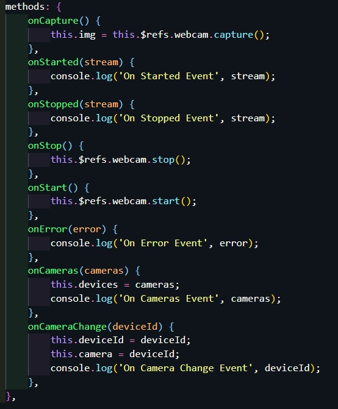

# camtest

## Using

<strong>vue-web-cam</strong>

https://www.npmjs.com/package/vue-web-cam


# vue-web-cam

[](https://www.npmjs.com/package/vue-web-cam) [](https://www.npmjs.com/package/vue-web-cam)  [](https://opensource.org/licenses/MIT)

Webcam component for VueJs. See [this](http://caniuse.com/#feat=stream) for browser compatibility.

## Installation

```
npm install vue-web-cam --save
// or
yarn add vue-web-cam
```

## Usage

```
import Vue from 'vue'
import WebCam from "../../src";
Vue.use(WebCam);
 
 
<vue-web-cam ... />
 
// or
import { WebCam } from "vue-web-cam";
 
components: {
    WebCam
}
 
<web-cam ... />
 
components: {
    'vue-web-cam': WebCam
}
 
<vue-web-cam ... />
```

## Nuxt.js

Add `vue-web-cam/nuxt` to modules section of `nuxt.config.js`

```
{
  modules: ['vue-web-cam/nuxt']
}
```

## Testing & Dev

```
npm run dev
```

### Props

<strong>Default값 주의!</strong>

| prop              | type    | default      | notes                                                        |
| ----------------- | ------- | ------------ | ------------------------------------------------------------ |
| height            | number  | 500          | height of video element                                      |
| width             | number  | 500          | width of video element                                       |
| autoplay          | boolean | true         | autoplay attribute                                           |
| screenshotFormat  | string  | 'image/jpeg' | format of screenshot                                         |
| selectFirstDevice | boolean | false        | select first device when avaialble<br />(available일 때 첫번째 device 선택) |
| deviceId          | string  | null         | currently selected camera                                    |
| playsinline       | boolean | true         | playsinline of video element                                 |
| resolution        | object  | null         | object with width and height for camera resolution           |


### Events ★★★★★

| name          | param    | notes                                                        |
| ------------- | -------- | ------------------------------------------------------------ |
| started       | stream   | emitted once the stream has started<br />스트림이 시작되면 방출 |
| stopped       | stream   | emitted once the stream has stopped                          |
| error         | error    | emitted if the stream failed to start with the error returned |
| notsupported  | error    | emitted when the browser does not support this feature<br />브라우저가 지원하지 않을 때 발생 |
| cameras       | cameras  | emitted when a list of all cameras available is loaded<br />사용 가능한 모든 카메라 목록이로드 될 때 발생합니다. |
| camera-change | deviceId | emitted when camera change occurs                            |
| video-live    | stream   | emitted when video is started                                |

### Methods ★★★★★

| name         | param    | notes                                                        |
| ------------ | -------- | ------------------------------------------------------------ |
| capture      | void     | Capture the current image through the webcam as base64 encoded string<br />웹캠을 통해 현재 이미지를 base64 인코딩 문자열로 캡처 |
| changeCamera | deviceId | change the currently selected camera. Must pass in the device ID<br />현재 선택된 카메라를 변경합니다. 장치 ID를 전달해야합니다. |
| start        | void     | Programmatically Start the camera after stopping it (relies on deviceId prop passed to the component)<br />카메라를 중지 한 후 프로그래밍 방식으로 시작 (구성 요소에 전달 된 deviceId prop에 따라 다름) |
| stop         | void     | Programmatically stop the camera                             |
| pause        | void     | Programmatically pause the camera                            |
| resume       | void     | Programmatically resume the camera after it was paused<br />일시 중지 된 후 카메라를 프로그래밍 방식으로 카메라 재게 |



## Contributing

If you'd like to help make this project better you can help with the following tasks:

- Tests - This project needs a way to test the functionality using a javascript testing solution (Jest as an example)
- Examples - Additional Examples of usage might be helpful to others.
- Project Website - Perhaps launch a project website (on Github Pages) that'll showcase the plugin, Demo, Usage instructions, configuration etc..

## License

MIT

## Credits

This is based off [@smronju vue-webcam](https://github.com/smronju/vue-webcam) and [react-webcam](https://github.com/mozmorris/react-webcam)


## Project setup
```
npm install
```

### Compiles and hot-reloads for development
```
npm run serve
```

### Compiles and minifies for production
```
npm run build
```

### Lints and fixes files
```
npm run lint
```

### Customize configuration
See [Configuration Reference](https://cli.vuejs.org/config/).
